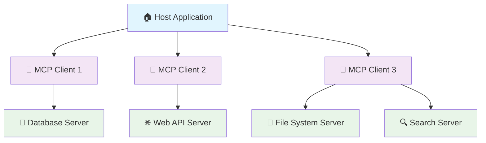

# mcp-server

# 🌟 Model Context Protocol (MCP) 


## 📋 Table of Contents

- [🌟 Model Context Protocol (MCP) - Complete Information Guide](#-model-context-protocol-mcp---complete-information-guide)
  - [📋 Table of Contents](#-table-of-contents)
  - [🎯 What is MCP?](#-what-is-mcp)
  - [🏗️ Architecture Overview](#️-architecture-overview)
  - [🔧 Core Features](#-core-features)
  - [📚 Official SDKs](#-official-sdks)
  - [🖥️ MCP Clients](#️-mcp-clients)
  - [🔌 Reference Servers](#-reference-servers)
  - [🏢 Official Integrations](#-official-integrations)
  - [🌍 Community Servers](#-community-servers)
  - [🛠️ Frameworks & Tools](#️-frameworks--tools)
  - [📖 Resources & Learning](#-resources--learning)
  - [🔒 Security & Trust](#-security--trust)
  - [🚀 Getting Started](#-getting-started)
  - [🤝 Contributing](#-contributing)
  - [📄 License](#-license)

---

## 🎯 What is MCP?

The **Model Context Protocol (MCP)** is an open protocol that enables seamless integration between LLM applications and external data sources and tools. Whether you're building an AI-powered IDE, enhancing a chat interface, or creating custom AI workflows, MCP provides a standardized way to connect LLMs with the context they need.

### 🌟 Key Benefits

- **🔗 Standardized Integration**: One protocol to connect any LLM application with any data source
- **🧩 Composable Architecture**: Mix and match servers to build powerful AI workflows
- **🔒 Security First**: Built-in security principles and user consent controls
- **🚀 Easy to Build**: Simple interfaces for creating servers and clients
- **🌐 Growing Ecosystem**: 500+ servers and 50+ clients already available

### 🎨 Core Concepts

MCP provides three main primitives:

1. **📄 Resources**: Context and data for the user or AI model to use
2. **🎯 Prompts**: Templated messages and workflows for users
3. **🛠️ Tools**: Functions for the AI model to execute
4. **🔄 Sampling**: Server-initiated agentic behaviors and recursive LLM interactions

---

## 🏗️ Architecture Overview

MCP follows a client-host-server architecture where each host can run multiple client instances:



### 🔧 Components

- **🏠 Host**: The container and coordinator (creates clients, manages security, handles authorization)
- **📱 Clients**: Isolated server connections (protocol negotiation, message routing, security boundaries)
- **🔧 Servers**: Specialized context and capabilities providers (expose resources, tools, prompts)

---

## 🔧 Core Features

### 📄 Resources
Resources allow servers to share data that provides context to language models:
- 📁 Files and documents
- 🗄️ Database schemas
- 🌐 API responses
- 📊 Application-specific information

### 🎯 Prompts
Pre-defined templates or instructions that guide language model interactions:
- 🔄 Reusable templates
- 📝 Dynamic arguments
- 🎨 Multi-step workflows
- 💡 Interactive guidance

### 🛠️ Tools
Executable functions that allow models to perform actions:
- 🔍 Query databases
- 📞 Call APIs
- 🧮 Perform computations
- 🔄 Execute workflows

### 🔄 Sampling
Server-initiated LLM interactions for agentic behaviors:
- 🤖 Nested LLM calls
- 🔄 Recursive interactions
- 🎯 Context-aware completions
- 👤 Human-in-the-loop controls

---

## 📚 Official SDKs

<div align="center">

| Language | Repository | Stars | Description |
|----------|------------|-------|-------------|
| **TypeScript** | [typescript-sdk](https://github.com/modelcontextprotocol/typescript-sdk) |  | Official TypeScript SDK |
| **Python** | [python-sdk](https://github.com/modelcontextprotocol/python-sdk) |  | Official Python SDK |
| **Java** | [java-sdk](https://github.com/modelcontextprotocol/java-sdk) |  | Official Java SDK (with Spring AI) |
| **Kotlin** | [kotlin-sdk](https://github.com/modelcontextprotocol/kotlin-sdk) |  | Official Kotlin SDK (with JetBrains) |
| **C#** | [csharp-sdk](https://github.com/modelcontextprotocol/csharp-sdk) |  | Official C# SDK (with Microsoft) |
| **Swift** | [swift-sdk](https://github.com/modelcontextprotocol/swift-sdk) |  | Official Swift SDK |
| **Ruby** | [ruby-sdk](https://github.com/modelcontextprotocol/ruby-sdk) |  | Official Ruby SDK (with Shopify) |

</div>

### 🚀 Quick Start Examples

<details>
<summary><strong>🟦 TypeScript Example</strong></summary>

```typescript
import { McpServer } from "@modelcontextprotocol/sdk/server/mcp.js";
import { StdioServerTransport } from "@modelcontextprotocol/sdk/server/stdio.js";
import { z } from "zod";

// Create an MCP server
const server = new McpServer({
  name: "Demo",
  version: "1.0.0"
});

// Add a tool
server.tool("add",
  { a: z.number(), b: z.number() },
  async ({ a, b }) => ({
    content: [{ type: "text", text: String(a + b) }]
  })
);

// Start the server
const transport = new StdioServerTransport();
await server.connect(transport);
```

</details>

<details>
<summary><strong>🐍 Python Example</strong></summary>

```python
from mcp.server import Server
import mcp.types as types

app = Server("demo-server")

@app.tool()
async def add(a: float, b: float) -> str:
    """Add two numbers together."""
    return str(a + b)

# Run with: python -m mcp.server.stdio server.py
```

</details>

---

## 🖥️ MCP Clients

### 🌟 Featured Clients

<div align="center">

| Client | Features | Resources | Prompts | Tools | Sampling | Notes |
|--------|----------|-----------|---------|-------|----------|-------|
| **🤖 Claude Desktop** | ✅ Full Support | ✅ | ✅ | ✅ | ❌ | Official Anthropic client |
| **🌐 Claude.ai** | ✅ Remote MCP | ✅ | ✅ | ✅ | ❌ | Web-based client |
| **💻 Cursor** | ✅ Tools | ❌ | ❌ | ✅ | ❌ | AI code editor |
| **🌪️ Windsurf** | ✅ Tools + Discovery | ❌ | ❌ | ✅ | ✅ | Agentic IDE |
| **🔧 Cline** | ✅ Tools + Resources | ✅ | ❌ | ✅ | ✅ | VS Code extension |
| **🔄 Continue** | ✅ Full Support | ✅ | ✅ | ✅ | ❓ | Open-source AI assistant |

</div>

### 📱 Complete Client List

<details>
<summary><strong>🖥️ Desktop Applications</strong></summary>

- **🤖 Claude Desktop App** - Full MCP support with local and remote servers
- **💻 Cursor** - AI code editor with tool support
- **🌪️ Windsurf Editor** - Agentic IDE with AI Flow
- **🔧 Cline** - Autonomous coding agent for VS Code
- **🔄 Continue** - Open-source AI code assistant
- **⚡ BoltAI** - Native AI chat client with MCP support
- **📝 Tome** - Cross-platform desktop app for local LLMs
- **🎨 Witsy** - AI desktop assistant for macOS, Windows, Linux

</details>

<details>
<summary><strong>🌐 Web Applications</strong></summary>

- **🌐 Claude.ai** - Web-based Claude with remote MCP servers
- **🎯 AgenticFlow** - No-code AI platform with 10,000+ tools
- **🔍 Glama** - AI workspace with MCP integration
- **🧠 MindPal** - No-code platform for AI agents
- **🎪 Superinterface** - AI infrastructure platform
- **📊 Lutra** - AI agent for automated workflows

</details>

<details>
<summary><strong>🛠️ Developer Tools</strong></summary>

- **📊 Postman** - API client with MCP testing support
- **🔍 VS Code GitHub Copilot** - GitHub Copilot with MCP integration
- **🚀 GenAIScript** - JavaScript toolbox for LLM prompts
- **🎯 TheiaAI/TheiaIDE** - AI-enhanced development environment
- **🔧 JetBrains** - Work with code using JetBrains IDEs

</details>

<details>
<summary><strong>📱 Mobile & Messaging</strong></summary>

- **📱 WhatsMPC** - MCP client for WhatsApp
- **💬 Slack MCP Client** - Bridge between Slack and MCP servers
- **🎮 TypingMind App** - Advanced frontend for LLMs

</details>

---

## 🔌 Reference Servers

These servers demonstrate MCP features and the official SDKs:

<div align="center">

| Server | Description | Language | Features | Repository |
|--------|-------------|----------|----------|------------|
| **🔍 Brave Search** | Web and local search using Brave's API | TypeScript | Search, Web Content | [GitHub](https://github.com/modelcontextprotocol/servers/tree/main/src/brave-search) |
| **📁 Filesystem** | Secure file operations with access controls | TypeScript | File Management | [GitHub](https://github.com/modelcontextprotocol/servers/tree/main/src/filesystem) |
| **🔧 Git** | Tools to read, search, and manipulate Git repositories | Python | Version Control | [GitHub](https://github.com/modelcontextprotocol/servers/tree/main/src/git) |
| **🐙 GitHub** | Repository management and GitHub API integration | TypeScript | Code Management | [GitHub](https://github.com/modelcontextprotocol/servers/tree/main/src/github) |
| **🗄️ PostgreSQL** | Read-only database access with schema inspection | Python | Database | [GitHub](https://github.com/modelcontextprotocol/servers/tree/main/src/postgres) |
| **🕷️ Puppeteer** | Browser automation and web scraping | TypeScript | Web Automation | [GitHub](https://github.com/modelcontextprotocol/servers/tree/main/src/puppeteer) |
| **💾 Memory** | Knowledge graph-based persistent memory system | TypeScript | Data Storage | [GitHub](https://github.com/modelcontextprotocol/servers/tree/main/src/memory) |
| **⏰ Time** | Time and timezone conversion capabilities | TypeScript | Utilities | [GitHub](https://github.com/modelcontextprotocol/servers/tree/main/src/time) |

</div>

---

## 🏢 Official Integrations

Production-ready MCP servers maintained by companies:

### 🌟 Enterprise Platforms

<details>
<summary><strong>☁️ Cloud & Infrastructure</strong></summary>

- **☁️ AWS** - Specialized MCP servers for AWS services | [GitHub](https://github.com/awslabs/mcp)
- **🔵 Microsoft Azure** - Azure services integration | [GitHub](https://github.com/microsoft/mcp-azure)
- **🌐 Cloudflare** - Deploy and configure Cloudflare resources | [GitHub](https://github.com/cloudflare/mcp-server-cloudflare)
- **🔧 Pulumi** - Infrastructure as Code management | [GitHub](https://github.com/pulumi/mcp-server-pulumi)
- **⚙️ Terraform** - Infrastructure automation | [GitHub](https://github.com/hashicorp/mcp-terraform)
- **🐳 Kubernetes** - Container orchestration management | [GitHub](https://github.com/kubernetes/mcp-server-k8s)

</details>

<details>
<summary><strong>🗄️ Databases & Analytics</strong></summary>

- **🐘 PostgreSQL** - Database operations and queries | [GitHub](https://github.com/modelcontextprotocol/servers/tree/main/src/postgres)
- **🏠 ClickHouse** - Real-time analytics database | [GitHub](https://github.com/ClickHouse/mcp-server-clickhouse)
- **🔍 Elasticsearch** - Search and analytics engine | [GitHub](https://github.com/elastic/mcp-elasticsearch)
- **📊 BigQuery** - Google's data warehouse | [GitHub](https://github.com/google-cloud/mcp-bigquery)
- **🦆 MotherDuck** - DuckDB cloud analytics | [GitHub](https://github.com/MotherDuck-Open-Source/mcp-server-motherduck)
- **⚡ SingleStore** - Real-time database platform | [GitHub](https://github.com/singlestore-labs/mcp-server-singlestore)
- **🌟 StarRocks** - High-performance analytics database | [GitHub](https://github.com/StarRocks/mcp-server-starrocks)

</details>

<details>
<summary><strong>🛠️ Development Tools</strong></summary>

- **🐙 GitHub** - Official GitHub MCP server | [GitHub](https://github.com/github/github-mcp-server)
- **🦊 GitLab** - GitLab API integration | [GitHub](https://github.com/gitlab-org/mcp-server-gitlab)
- **🔄 CircleCI** - CI/CD pipeline management | [GitHub](https://github.com/circleci/mcp-server-circleci)
- **🚀 Buildkite** - Build automation platform | [GitHub](https://github.com/buildkite/mcp-server-buildkite)
- **🧪 Sentry** - Error tracking and monitoring | [GitHub](https://github.com/getsentry/mcp-server-sentry)
- **📊 Grafana** - Monitoring and observability | [GitHub](https://github.com/grafana/mcp-server-grafana)

</details>

<details>
<summary><strong>💼 Business Applications</strong></summary>

- **📧 Slack** - Team communication platform | [GitHub](https://github.com/slack-samples/mcp-server-slack)
- **📝 Notion** - Workspace and documentation | [GitHub](https://github.com/makenotion/mcp-server-notion)
- **📋 Linear** - Project management and issue tracking | [GitHub](https://github.com/linear/mcp-server-linear)
- **💰 Stripe** - Payment processing platform | [GitHub](https://github.com/stripe/mcp-server-stripe)
- **💳 PayPal** - Payment services integration | [GitHub](https://github.com/paypal/mcp-server-paypal)
- **📊 HubSpot** - CRM and marketing platform | [GitHub](https://github.com/HubSpot/mcp-server-hubspot)

</details>

### 🔍 Search & AI

<details>
<summary><strong>🔍 Search Engines</strong></summary>

- **🔍 Exa** - Search engine made for AIs | [GitHub](https://github.com/exa-labs/mcp-server-exa)
- **🌐 Tavily** - Search engine for AI agents | [GitHub](https://github.com/tavily-ai/mcp-server-tavily)
- **🔎 Kagi Search** - Privacy-focused search API | [GitHub](https://github.com/kagisearch/mcp-server-kagi)
- **🌟 Perplexity** - Real-time web research API | [GitHub](https://github.com/perplexity-ai/mcp-server-perplexity)

</details>

<details>
<summary><strong>🤖 AI & ML Platforms</strong></summary>

- **🧠 OpenAI** - GPT models and AI services | [GitHub](https://github.com/openai/mcp-server-openai)
- **🎯 Anthropic** - Claude AI integration | [GitHub](https://github.com/anthropics/mcp-server-anthropic)
- **🔥 Logfire** - OpenTelemetry traces and metrics | [GitHub](https://github.com/pydantic/logfire-mcp)
- **📊 Langfuse** - LLM observability and analytics | [GitHub](https://github.com/langfuse/mcp-server-langfuse)
- **🎨 ElevenLabs** - Text-to-speech AI platform | [GitHub](https://github.com/elevenlabs/mcp-server-elevenlabs)

</details>

---

## 🌍 Community Servers

A growing ecosystem of community-developed servers:

### 🌟 Popular Community Servers

<div align="center">

| Server | Description | Language | Repository | Website |
|--------|-------------|----------|------------|---------|
| **🔍 Brave Search** | Web search using Brave API | TypeScript | [GitHub](https://github.com/modelcontextprotocol/servers/tree/main/src/brave-search) | [Brave](https://brave.com) |
| **🌐 WhatsApp MCP** | WhatsApp integration server | TypeScript | [GitHub](https://github.com/lharries/whatsapp-mcp) | [Demo](https://whatsapp-mcp.com) |
| **🎨 Figma Context** | Figma design context integration | TypeScript | [GitHub](https://github.com/GLips/Figma-Context-MCP) | [Figma](https://figma.com) |
| **🔄 n8n Nodes** | Workflow automation integration | TypeScript | [GitHub](https://github.com/nerding-io/n8n-nodes-mcp) | [n8n](https://n8n.io) |
| **🌐 Browser MCP** | Browser automation and control | TypeScript | [GitHub](https://github.com/BrowserMCP/mcp) | [Demo](https://browsermcp.com) |
| **📊 Awesome MCP ZH** | Chinese MCP resources collection | - | [GitHub](https://github.com/yzfly/Awesome-MCP-ZH) | [Website](https://awesome-mcp-zh.com) |

</div>

### 📊 Data & Analytics

<details>
<summary><strong>🗄️ Database Servers</strong></summary>

- **🐘 PostgreSQL** - Multiple implementations for PostgreSQL | [GitHub](https://github.com/modelcontextprotocol/servers/tree/main/src/postgres)
- **🟢 MongoDB** - NoSQL database integration | [GitHub](https://github.com/mongodb/mcp-server-mongodb)
- **🔴 Redis** - In-memory data structure store | [GitHub](https://github.com/redis/mcp-server-redis)
- **🦆 DuckDB** - Analytical database engine | [GitHub](https://github.com/duckdb/mcp-server-duckdb)
- **📊 InfluxDB** - Time series database | [GitHub](https://github.com/influxdata/mcp-server-influxdb)
- **🌐 Neo4j** - Graph database platform | [GitHub](https://github.com/neo4j/mcp-server-neo4j)
- **❄️ Snowflake** - Cloud data warehouse | [GitHub](https://github.com/snowflakedb/mcp-server-snowflake)

</details>

<details>
<summary><strong>📈 Analytics & Visualization</strong></summary>

- **📊 Chart.js** - Data visualization library | [GitHub](https://github.com/chartjs/mcp-server-chartjs)
- **📈 Vega-Lite** - Grammar of interactive graphics | [GitHub](https://github.com/vega/mcp-server-vega)
- **📊 QuickChart** - Chart generation service | [GitHub](https://github.com/typpo/mcp-server-quickchart)
- **📉 Grafana** - Monitoring and observability | [GitHub](https://github.com/grafana/mcp-server-grafana)
- **🔍 Elasticsearch** - Search and analytics | [GitHub](https://github.com/elastic/mcp-elasticsearch)

</details>

### 🌐 Web & APIs

<details>
<summary><strong>🌐 Web Services</strong></summary>

- **🌐 Fetch** - Web content fetching and conversion | [GitHub](https://github.com/modelcontextprotocol/servers/tree/main/src/fetch)
- **🕷️ Playwright** - Browser automation | [GitHub](https://github.com/microsoft/playwright-mcp)
- **🔍 SearXNG** - Privacy-respecting search engine | [GitHub](https://github.com/searxng/mcp-server-searxng)
- **📸 ScreenshotOne** - Website screenshot service | [GitHub](https://github.com/screenshotone/mcp-server-screenshotone)
- **🌐 Firecrawl** - Web scraping and data extraction | [GitHub](https://github.com/mendableai/firecrawl-mcp)

</details>

<details>
<summary><strong>🔗 API Integration</strong></summary>

- **🔗 OpenAPI** - REST API integration | [GitHub](https://github.com/openapi/mcp-server-openapi)
- **📡 GraphQL** - GraphQL API support | [GitHub](https://github.com/graphql/mcp-server-graphql)
- **🔌 Zapier** - Connect 8,000+ apps | [GitHub](https://github.com/zapier/mcp-server-zapier)
- **🔄 Make** - Automation platform integration | [GitHub](https://github.com/integromat/mcp-server-make)
- **🌐 Postman** - API development platform | [GitHub](https://github.com/postmanlabs/mcp-server-postman)

</details>

### 🛠️ Development Tools

<details>
<summary><strong>💻 Code & Development</strong></summary>

- **🔧 Git** - Version control operations | [GitHub](https://github.com/modelcontextprotocol/servers/tree/main/src/git)
- **🐙 GitHub** - GitHub API integration | [GitHub](https://github.com/github/github-mcp-server)
- **🦊 GitLab** - GitLab platform integration | [GitHub](https://github.com/gitlab-org/mcp-server-gitlab)
- **📝 VS Code** - Editor integration | [GitHub](https://github.com/microsoft/vscode-mcp)
- **🎯 JetBrains** - IDE integration | [GitHub](https://github.com/jetbrains/mcp-jetbrains)
- **🔍 Language Server** - LSP integration | [GitHub](https://github.com/microsoft/language-server-mcp)

</details>

<details>
<summary><strong>🧪 Testing & Quality</strong></summary>

- **🧪 Jest** - JavaScript testing framework | [GitHub](https://github.com/jestjs/mcp-server-jest)
- **🔍 ESLint** - Code linting and quality | [GitHub](https://github.com/eslint/mcp-server-eslint)
- **🛡️ Semgrep** - Static analysis security | [GitHub](https://github.com/semgrep/mcp-server-semgrep)
- **🔒 Snyk** - Security vulnerability scanning | [GitHub](https://github.com/snyk/mcp-server-snyk)
- **📊 SonarQube** - Code quality analysis | [GitHub](https://github.com/sonarqube/mcp-server-sonar)

</details>

### 📱 Productivity & Office

<details>
<summary><strong>📝 Documentation & Notes</strong></summary>

- **📝 Obsidian** - Knowledge management | [GitHub](https://github.com/obsidianmd/mcp-server-obsidian)
- **📓 Notion** - Workspace and notes | [GitHub](https://github.com/makenotion/mcp-server-notion)
- **📋 Markdown** - Markdown processing | [GitHub](https://github.com/markdown-it/mcp-server-markdown)
- **📄 Pandoc** - Document conversion | [GitHub](https://github.com/jgm/mcp-server-pandoc)
- **📚 Confluence** - Team documentation | [GitHub](https://github.com/atlassian/mcp-server-confluence)

</details>

<details>
<summary><strong>📅 Calendar & Tasks</strong></summary>

- **📅 Google Calendar** - Calendar management | [GitHub](https://github.com/google/mcp-server-calendar)
- **✅ Todoist** - Task management | [GitHub](https://github.com/doist/mcp-server-todoist)
- **📋 Trello** - Project boards | [GitHub](https://github.com/atlassian/mcp-server-trello)
- **📊 Asana** - Team project management | [GitHub](https://github.com/asana/mcp-server-asana)
- **🎯 Linear** - Issue tracking | [GitHub](https://github.com/linear/mcp-server-linear)

</details>

### 🎨 Media & Content

<details>
<summary><strong>🎨 Image & Video</strong></summary>

- **🎨 DALL-E** - AI image generation | [GitHub](https://github.com/openai/mcp-server-dalle)
- **🖼️ Stable Diffusion** - Image generation | [GitHub](https://github.com/stability-ai/mcp-server-sd)
- **📹 FFmpeg** - Video processing | [GitHub](https://github.com/ffmpeg/mcp-server-ffmpeg)
- **🎬 YouTube** - Video platform integration | [GitHub](https://github.com/youtube/mcp-server-youtube)
- **📸 Unsplash** - Stock photography | [GitHub](https://github.com/unsplash/mcp-server-unsplash)

</details>

<details>
<summary><strong>🎵 Audio & Music</strong></summary>

- **🎵 Spotify** - Music streaming platform | [GitHub](https://github.com/spotify/mcp-server-spotify)
- **🎙️ Podcast** - Podcast management | [GitHub](https://github.com/podcast/mcp-server-podcast)
- **🔊 Audio Processing** - Audio manipulation | [GitHub](https://github.com/audio/mcp-server-audio)
- **🎼 Music Theory** - Musical analysis tools | [GitHub](https://github.com/music-theory/mcp-server-theory)

</details>

---

## 🛠️ Frameworks & Tools

### 🏗️ Server Frameworks

<details>
<summary><strong>🚀 TypeScript Frameworks</strong></summary>

- **⚡ FastMCP** - Fast TypeScript framework | [GitHub](https://github.com/fastmcp/fastmcp)
- **🎯 EasyMCP** - Simple TypeScript framework | [GitHub](https://github.com/easymcp/easymcp)
- **🏗️ MCP-Framework** - Elegant TypeScript framework with CLI | [GitHub](https://github.com/mcp-framework/mcp-framework)
- **📝 Template MCP Server** - CLI tool for new projects | [GitHub](https://github.com/modelcontextprotocol/create-mcp-server)

</details>

<details>
<summary><strong>🐍 Python Frameworks</strong></summary>

- **🌸 Spring AI MCP Server** - Spring Boot auto-configuration
- **⚡ FastAPI to MCP** - Auto-generate MCP from FastAPI
- **🔧 Quarkus MCP Server SDK** - Java framework integration

</details>

<details>
<summary><strong>🌐 Multi-Language</strong></summary>

- **🦀 Rust Frameworks** - Rust-based MCP implementations
- **☕ Java Frameworks** - Enterprise Java solutions
- **🔷 Go Frameworks** - High-performance Go servers
- **🔶 C++ Frameworks** - Native performance solutions

</details>

### 🔧 Development Tools

<details>
<summary><strong>🛠️ CLI Tools</strong></summary>

- **🔍 mcp-cli** - CLI inspector for MCP servers | [GitHub](https://github.com/modelcontextprotocol/mcp-cli)
- **📦 mcp-get** - Command line tool for installing servers | [GitHub](https://github.com/mcp-tools/mcp-get)
- **🎯 mcpm** - MCP Manager (Homebrew-like service) | [GitHub](https://github.com/mcp-tools/mcpm)
- **🔧 mcp-manager** - Web UI for managing MCP servers | [GitHub](https://github.com/mcp-tools/mcp-manager)

</details>

<details>
<summary><strong>🖥️ GUI Applications</strong></summary>

- **🎨 MCP Inspector** - Visual testing tool for servers | [GitHub](https://github.com/modelcontextprotocol/inspector)
- **🖥️ MCPHub** - Desktop app for discovering servers | [GitHub](https://github.com/mcp-tools/mcphub)
- **🎯 MCP Router** - Windows/macOS management app | [GitHub](https://github.com/mcp-tools/mcp-router)
- **🔧 mcp-dockmaster** - UI for server management | [GitHub](https://github.com/mcp-tools/mcp-dockmaster)

</details>

### 🌐 Hosting & Deployment

<details>
<summary><strong>☁️ Cloud Platforms</strong></summary>

- **☁️ mcp.run** - Hosted registry and control plane | [Website](https://mcp.run)
- **🌐 MCPVerse** - Portal for creating hosted servers | [Website](https://mcpverse.com)
- **🔧 Smithery** - Registry of MCP servers | [Website](https://smithery.ai)
- **📊 PulseMCP** - Community hub and newsletter | [Website](https://pulsemcp.com)

</details>

<details>
<summary><strong>🐳 Containerization</strong></summary>

- **🐳 Docker Images** - Pre-built server containers
- **☸️ Kubernetes** - Orchestration for MCP servers
- **🔧 Helm Charts** - Kubernetes deployment charts
- **🚀 Docker Compose** - Multi-container deployments

</details>

---

## 📖 Resources & Learning

### 📚 Documentation

<details>
<summary><strong>📖 Official Documentation</strong></summary>

- **📖 [MCP Documentation](https://modelcontextprotocol.io)** - Complete user guide
- **🔧 [MCP Specification](https://spec.modelcontextprotocol.io/)** - Technical specification
- **🚀 [Quickstart Guide](https://modelcontextprotocol.io/quickstart)** - Get started quickly
- **🎯 [Example Servers](https://modelcontextprotocol.io/servers)** - Reference implementations

</details>

<details>
<summary><strong>🎓 Tutorials & Guides</strong></summary>

- **🏗️ [Building MCP with LLMs](https://modelcontextprotocol.io/tutorials/building-mcp-with-llms)** - AI-assisted development
- **🐛 [Debugging Guide](https://modelcontextprotocol.io/tutorials/debugging)** - Troubleshooting tips
- **🔍 [Inspector Tutorial](https://modelcontextprotocol.io/tutorials/inspector)** - Testing servers

</details>

### 🌟 Community Resources

<details>
<summary><strong>🗂️ Awesome Lists</strong></summary>

- **⭐ [Awesome MCP Servers by punkpeye](https://github.com/punkpeye/awesome-mcp-servers)** - Curated list with website
- **⭐ [Awesome MCP Servers by wong2](https://github.com/wong2/awesome-mcp-servers)** - Community curated list
- **⭐ [Awesome MCP Servers by appcypher](https://github.com/appcypher/awesome-mcp-servers)** - Another curated collection
- **🔐 [Awesome Remote MCP Servers](https://github.com/JAW9C/awesome-remote-mcp-servers)** - Remote servers with auth

</details>

<details>
<summary><strong>💬 Community Platforms</strong></summary>

- **💬 [Discord Server](https://discord.gg/mcp)** - Community discussions
- **🗨️ [GitHub Discussions](https://github.com/modelcontextprotocol/servers/discussions)** - Technical discussions
- **📱 [Reddit r/mcp](https://reddit.com/r/mcp)** - Community forum
- **🐦 [Twitter/X Community](https://twitter.com/search?q=%23MCP)** - Latest updates

</details>

### 🎥 Learning Materials

<details>
<summary><strong>🎬 Videos & Workshops</strong></summary>

- **🎯 [Building Agents with MCP Workshop](https://www.youtube.com/watch?v=kQmXtrmQ5Zg)** - AI Engineer Summit
- **📺 [MCP Tutorial Series](https://www.youtube.com/playlist?list=PLMcp)** - Step-by-step guides
- **🎪 [Conference Talks](https://www.youtube.com/results?search_query=model+context+protocol)** - Expert presentations

</details>

<details>
<summary><strong>📝 Articles & Blogs</strong></summary>

- **📰 [Anthropic Engineering Blog](https://www.anthropic.com/engineering)** - Official updates
- **📝 [Medium Articles](https://medium.com/search?q=model%20context%20protocol)** - Community tutorials
- **📖 [Dev.to Posts](https://dev.to/search?q=mcp)** - Developer experiences

</details>

---

## 🔒 Security & Trust

### 🛡️ Security Principles

MCP is built with security as a core principle:

1. **👤 User Consent and Control**
   - Users must explicitly consent to all data access and operations
   - Users retain control over what data is shared and actions taken
   - Clear UIs for reviewing and authorizing activities

2. **🔐 Data Privacy**
   - Explicit user consent before exposing data to servers
   - No transmission of resource data without consent
   - Appropriate access controls and data protection

3. **🛠️ Tool Safety**
   - Tools represent arbitrary code execution - treated with caution
   - Explicit user consent before invoking any tool
   - Users understand what each tool does before authorization

4. **🤖 LLM Sampling Controls**
   - Users explicitly approve LLM sampling requests
   - Control over sampling occurrence, prompts, and results
   - Limited server visibility into prompts

### 🔐 Authentication & Authorization

<details>
<summary><strong>🔑 OAuth 2.0 Integration</strong></summary>

- **🔐 Standardized Authentication** - OAuth 2.0 for secure access
- **🎫 Token Management** - Server-controlled token handling
- **🔒 Secure Flows** - Web-based authorization flows
- **🛡️ Permission Management** - Granular access controls

</details>

<details>
<summary><strong>🛡️ Security Best Practices</strong></summary>

- **✅ Input Validation** - Validate all user inputs
- **🔒 Access Controls** - Implement appropriate permissions
- **📊 Audit Logging** - Track all operations
- **⏱️ Rate Limiting** - Prevent abuse
- **🔐 Encryption** - Secure data in transit and at rest

</details>

---

## 🚀 Getting Started

### 🎯 Quick Start

1. **📖 Read the Documentation**
   ```bash
   # Visit the official documentation
   open https://modelcontextprotocol.io
   ```

2. **🔧 Install an SDK**
   ```bash
   # TypeScript
   npm install @modelcontextprotocol/sdk
   
   # Python
   pip install mcp
   
   # Java (Maven)
   <dependency>
     <groupId>io.modelcontextprotocol.sdk</groupId>
     <artifactId>mcp</artifactId>
   </dependency>
   ```

3. **🏗️ Create Your First Server**
   ```bash
   # Using the TypeScript template
   npx create-mcp-server my-server
   
   # Using Python
   python -m mcp.server.stdio my_server.py
   ```

4. **🧪 Test with Inspector**
   ```bash
   # Install and run the inspector
   npx @modelcontextprotocol/inspector
   ```

### 📚 Learning Path

1. **🎯 Beginner**: Start with the [Quickstart Guide](https://modelcontextprotocol.io/quickstart)
2. **🔧 Intermediate**: Build a custom server using the [SDK Documentation](https://modelcontextprotocol.io/sdk)
3. **🚀 Advanced**: Explore [Advanced Patterns](https://modelcontextprotocol.io/tutorials) and contribute to the ecosystem

### 🛠️ Development Setup

<details>
<summary><strong>🔧 Development Environment</strong></summary>

```bash
# Clone the main repository
git clone https://github.com/modelcontextprotocol/servers.git
cd servers

# Install dependencies
npm install

# Run tests
npm test

# Start development server
npm run dev
```

</details>

<details>
<summary><strong>🧪 Testing Your Server</strong></summary>

```bash
# Use the MCP Inspector
npx @modelcontextprotocol/inspector

# Or test with Claude Desktop
# Add to your Claude Desktop config:
{
  "mcpServers": {
    "my-server": {
      "command": "node",
      "args": ["path/to/your/server.js"]
    }
  }
}
```

</details>

---

